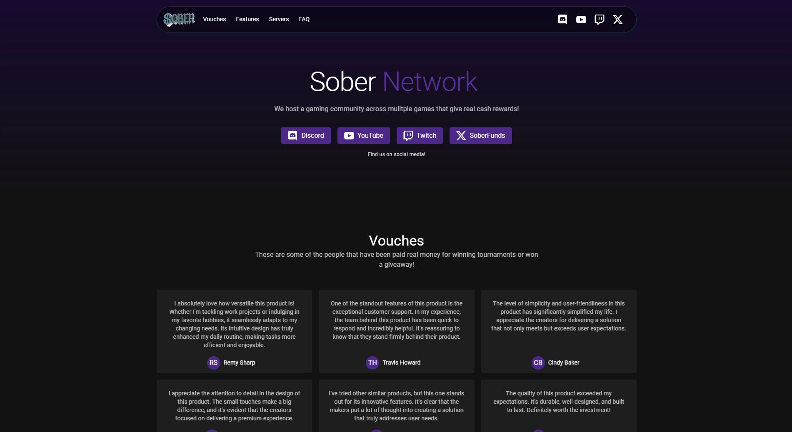
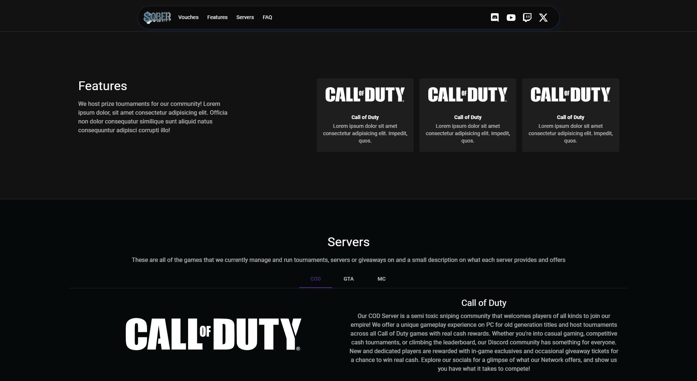

# Campaign Site

A simple React website made for a client. Based on the MUI Home page example. All of the site is editable through the [config.js](src/config.js) file.

---

### How To Run

```sh
git clone https://github.com/wuxnz/six-campaign-site.git
cd six-campaign-site
npm install
npm start
```

---

### Live Site
[sober.money](https://sober.money)

---

### Screenshots

| Landing Section | Features and Servers | FAQ and Footer |
|-----------------|----------------------|----------------|
|  |  |  |
